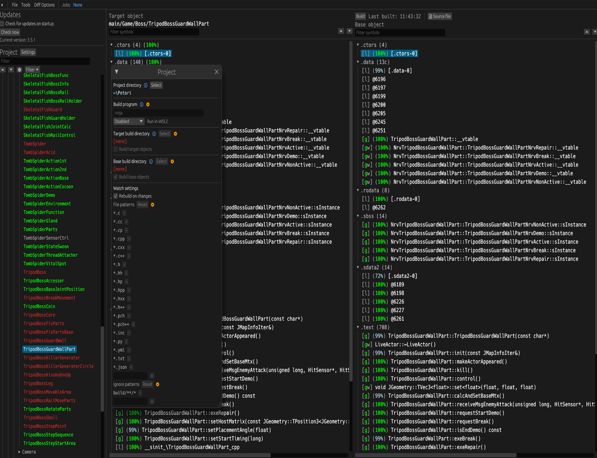

Garigari  
=============
[![Build Status]][actions] ![Progress] [![Discord Badge]][discord]
<!--
Replace with your repository's URL.
-->
[Build Status]: https://github.com/SMGCommunity/Garigari/actions/workflows/build.yml/badge.svg
[actions]: https://github.com/SMGCommunity/Garigari/actions/workflows/build.yml
<!---
Code progress URL:
https://progress.decomp.club/data/[project]/[version]/all/?mode=shield&measure=code
URL encoded then appended to: https://img.shields.io/endpoint?label=Code&url=
-->
[Progress]: https://decomp.dev/SMGCommunity/Garigari.svg?mode=shield&measure=code&label=Code
<!---
DOL progress URL:
https://progress.decomp.club/data/[project]/[version]/dol/?mode=shield&measure=code
URL encoded then appended to: https://img.shields.io/endpoint?label=DOL&url=
-->

[Discord Badge]: https://img.shields.io/discord/727908905392275526?color=%237289DA&logo=discord&logoColor=%23FFFFFF
[discord]: https://discord.gg/ZxEqyYeZbf

A work-in-progress decompilation of Super Mario Galaxy 2.

This repository does **not** contain any game assets or assembly whatsoever. An existing copy of the game is required.

Supported versions:

- `SB4E01`: Rev 0 (USA)

Dependencies
============

Windows
--------

On Windows, it's **highly recommended** to use native tooling. WSL or msys2 are **not** required.  
When running under WSL, [objdiff](#diffing) is unable to get filesystem notifications for automatic rebuilds.

- Install [Python](https://www.python.org/downloads/) and add it to `%PATH%`.
  - Also available from the [Windows Store](https://apps.microsoft.com/store/detail/python-311/9NRWMJP3717K).
- Download [ninja](https://github.com/ninja-build/ninja/releases) and add it to `%PATH%`.
  - Quick install via pip: `pip install ninja`

macOS
------

- Install [ninja](https://github.com/ninja-build/ninja/wiki/Pre-built-Ninja-packages):

  ```sh
  brew install ninja
  ```

- Install [wine-stable](https://github.com/Gcenx/macOS_Wine_builds):

  ```sh
  brew install --cask wine-stable
  ```

> [!NOTE]
> The previously recommended `wine-crossover` cask has been discontinued; its cask was removed from the `gcenx/wine` tap and its downloads are no longer hosted. Current WineHQ builds support running 32-bit Windows binaries out of the box. If the `wine-stable` cask is unavailable, official builds can be downloaded from [Gcenx/macOS_Wine_builds](https://github.com/Gcenx/macOS_Wine_builds/releases).

Since the WineHQ builds are not notarized, macOS may block `Wine Stable.app` from running. If `wine` is killed on launch, unquarantine it using:

```sh
sudo xattr -rd com.apple.quarantine '/Applications/Wine Stable.app'
```

Linux
------

- Install [ninja](https://github.com/ninja-build/ninja/wiki/Pre-built-Ninja-packages).
- For non-x86(_64) platforms: Install wine from your package manager.
  - For x86(_64), [wibo](https://github.com/decompals/wibo), a minimal 32-bit Windows binary wrapper, will be automatically downloaded and used.

Building
========

- Clone the repository:

  ```sh
  git clone https://github.com/SMGCommunity/Garigari.git
  ```

- Copy your game's disc image to `orig/SB4E01`.
  - Supported formats: ISO (GCM), RVZ, WIA, WBFS, CISO, NFS, GCZ, TGC
  - After the initial build, the disc image can be deleted to save space.

- Configure:

  ```sh
  python configure.py
  ```

  To use a version other than `SB4E01` (USA), specify it with `--version`.

- Build:

  ```sh
  ninja
  ```

Diffing
=======

Once the initial build succeeds, an `objdiff.json` should exist in the project root.

Download the latest release from [encounter/objdiff](https://github.com/encounter/objdiff). Under project settings, set `Project directory`. The configuration should be loaded automatically.

Select an object from the left sidebar to begin diffing. Changes to the project will rebuild automatically: changes to source files, headers, `configure.py`, `splits.txt` or `symbols.txt`.


